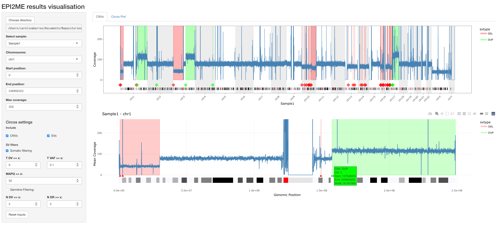
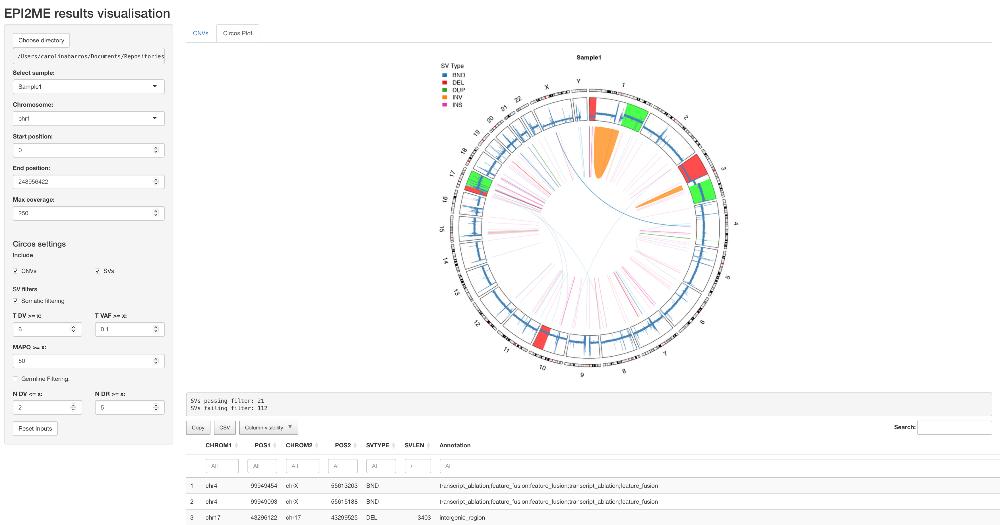

# Visualise CNAs from EPI2ME wf-human-variation

Rshiny app to visualise CNAs and SVs detected with the [EPI2ME wf-human-variation](https://github.com/epi2me-labs/wf-human-variation) and [EPI2ME wf-somatic-variation](https://github.com/epi2me-labs/wf-somatic-variation) workflows.  


**CNAs** can be visualised in several ways:  
- `Multi-chromosome` plot with a small overview of all chromosomes - coverage and CNAs   
- `Single-chromosome` plot with coverage and CNAs for the selected chromosome  
- `Circos` plot with genome wide CNA and SVs   
These plots show the mean coverage per genomic region (blue line) and the CNA predictions from wf-human-variation in green (gain) or red (loss). The small triangles show the start position of the CNA (sometimes the CNAs are so small that the corresponding line is not clear). In addition, the chromosome cytoband is included below the single chromosome plot. The plots are interactive.  

**SVs** can be visualised in the `Circos` plot, together with the CNAs. The SVs can be filtered according to:  
_Tumor sample_:  
- number of reads supporting ALT allele  
- VAF  
- MAPQ  
_Normal sample_:  
- number of reads supporting ALT allele  
- number of reads supporting REF allele

The number of SVs after filtering is shown below the plot, together with a table with the details of the SVs. The table can be downloaded as a CSV file.



<br>



## Installation

This app was tested with R v4.5.0.  
If setting up with Rstudio: **File --> New project --> Version Control --> Repository URL**: `https://github.com/CarolinaPB/visualise_cnv_wf-human-variation.git` and choose where you want to save it

The R Renv package is used to take care of package dependencies. Use `renv::restore()` to install the necessary packages.

### Prepare data

The app expects a directory that contains the output files from the EPI2ME wf-human-variation: `<SAMPLE>.wf_cnv.vcf.gz` and `<SAMPLE>.regions.bed.gz`.   
To plot the SVs, the `<SAMPLE>/sv/severus-output/all_SVs/<SAMPLE>.severus_all.vcf` and `<SAMPLE>.wf-somatic-sv.vcf.gz` files are necessary. The latter needs to be converted to a tab-separated file.
The following command can be used. (gatk should be installed and available on the command line).  
The output file should be named `<SAMPLE>.SV_raw.tsv`

```bash
gatk VariantsToTable \
    -V "$vcf" \
    -O "<SAMPLE>.SV_raw.tsv" \
    -F CHROM -F POS -F ID -F REF -F ALT -F QUAL -F FILTER \
    -F PRECISE -F IMPRECISE -F SVTYPE -F SVLEN -F CHR2 -F END -F STRANDS \
    -F DETAILED_TYPE -F INSLEN -F MAPQ -F PHASESETID -F HP -F CLUSTERID \
    -F INSSEQ -F MATE_ID -F INSIDE_VNTR -F ALINGED_POS \
    -F ANN -F LOF -F NMD \
    -F DBVARID -F ALLELEID -F CLNSIG -F CLNVCSO -F SCIDNINCL -F CLNREVSTAT \
    -F ONCREVSTAT -F RS -F CLNDNINCL -F ONC -F ORIGIN -F ONCINCL -F ONCDNINCL \
    -F ONCDISDB -F SCIREVSTAT -F ONCDISDBINCL -F MC -F CLNDN -F ONCCONF \
    -F CLNVC -F SCIDISDB -F CLNVI -F AF_EXAC -F ONCDN -F AF_ESP -F CLNSIGINCL \
    -F CLNDISDB -F GENEINFO -F CLNDISDBINCL -F AF_TGP -F CLNSIGCONF \
    -F SCIDISDBINCL -F CLNHGVS -F SCIINCL -F SCIDN -F SCI \
    -GF GT -GF GQ -GF DR -GF DV -GF VAF -GF hVAF -GF SB -GF AB -GF RPA -GF RPB
```

This directory can contain the data for as many samples as you want. 
By default, the app expects the data to be in the included `data` directory. The data directory can be configured in the config file or it can be specified in the app

#### Set up config

The config file `cnv_nanopore/configs/config.yaml` is used to define the path for the data directory and other files.   
By default, the app will use the `data` directory in the current project directory. You can leave it as is or add your own path. Inside the app you'll also be able to select a different directory.

```yaml
default:
    data_path: "data"
    cytoband_file: "resources/cytoBandIdeo.txt"
    fai_file: "resources/GCA_000001405.15_GRCh38_no_alt_analysis_set.fna.fai"
```

## Launch app

You can start the app by running

```R
shiny::runApp('cnv_nanopore')
```

### Circos

The CNV plotting in the circos plots is off by default since it takes a long time to render.