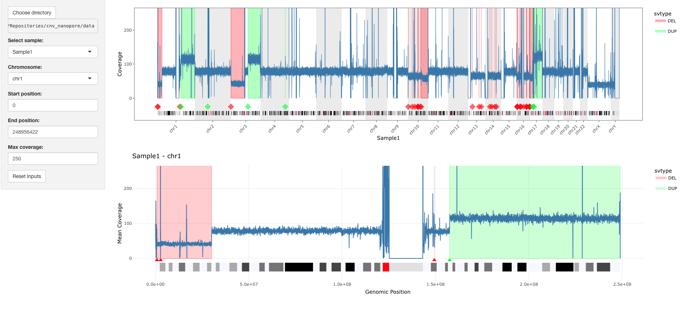

# CNV Nanopore

Rshiny app to visualise CNVs detected with the [EPI2ME wf-human-variation](https://github.com/epi2me-labs/wf-human-variation) workflow.



## Installation

This app was tested with R v4.5.0

```bash
git clone https://github.com/CarolinaPB/visualise_cnv_wf-human-variation.git
cd visualise_cnv_wf-human-variation
```

The R Renv package is used to take care of package dependencies. Use `renv::restore()` to set it up and install the necessary packages.

### Prepare data

The app expects a directory that contains the output files from the EPI2ME wf-human-variation: `<SAMPLE>.wf_cnv.vcf.gz` and `<SAMPLE>.regions.bed.gz`.   
This directory can contain the data for as many samples as you want. 
By default, the app expects the data to be in the included `data` directory. The data directory can be configured in the config file or it can be specified in the app

#### Set up config

The config file `cnv_nanopore/configs/config.yaml` is used to define the path for the data directory and other files.   
By default, the app will use the `data` directory in the current project directory. You can leave it as is or add your own path. Inside the app you'll also be able to select a different directory.

```yaml
default:
    data_path: "data"
    cytoband_file: "resources/cytoBandIdeo.txt"
    fai_file: "resources/GCA_000001405.15_GRCh38_no_alt_analysis_set.fna.fai"
```

## Launch app

You can start the app by running

```R
runApp('cnv_nanopore')
```